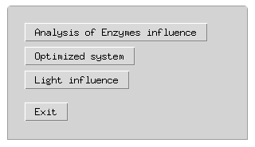

# Repository of codes used in iGEM Design League 2021 of [CNPEM.Brazil Team](https://app.jogl.io/project/687/RainbowDots)

## Mathematical model

## Information for judges 

You can download the version of iGEM Desing League here ([link](https://github.com/levandoskije/RainbowDotsCodes/releases/tag/v1.0))


### How to run the code?
 - Requeriments
 
	- Python >= 3.6
	- Numpy >= 1.19.2
	- Scipy >= 1.5.2
	- Matplotlib >= 3.3.2
	- Tkinter (optional)
   
 - Open the folder _MathModel_ file ```qds_model_light.py```
 - Open python terminal inside this folder
 - run: ```python qds_model_light.py```
 	- If you have Tkinter run automatically:
 	- Otherwise you need to open de script:
 		- comment the lines: 12, 388
 		- uncomment line: 386
 		
 		
When you run the code you need to choose the analysis
just click (or type in the command line):


 
 
 After the run, the code will save the results in the same folder.


## Metabolic Model

Are two folders _BacArena(R)_ and _Gapseq and Python codes_
Inside of them are files in pdf with explanation of the codes
